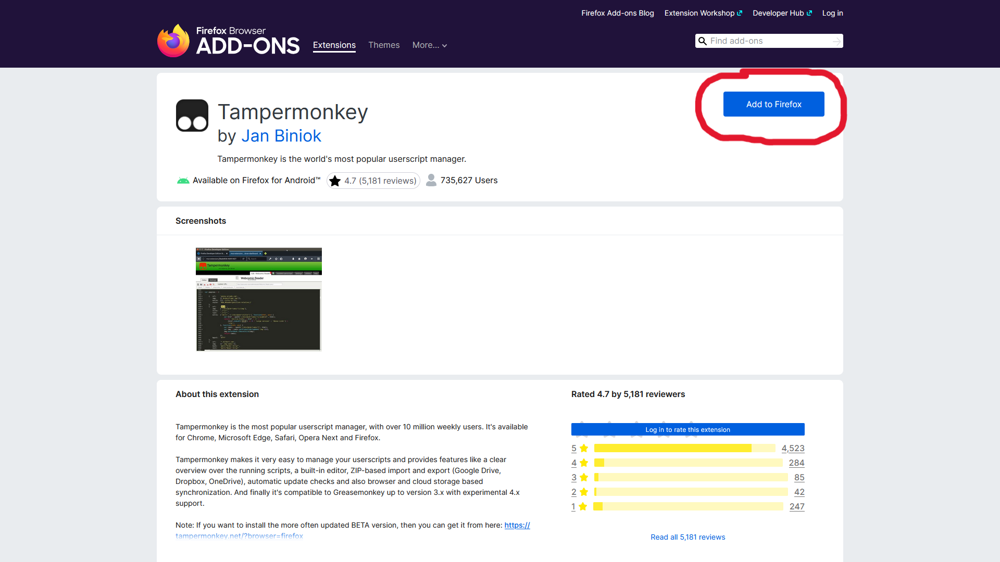
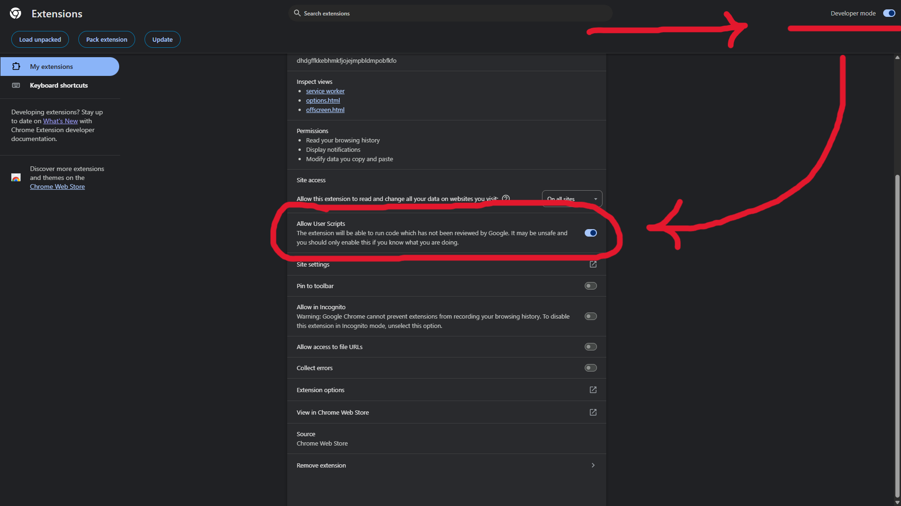
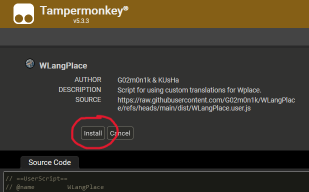
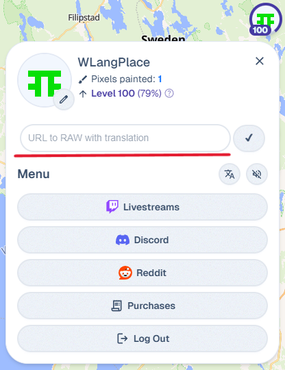
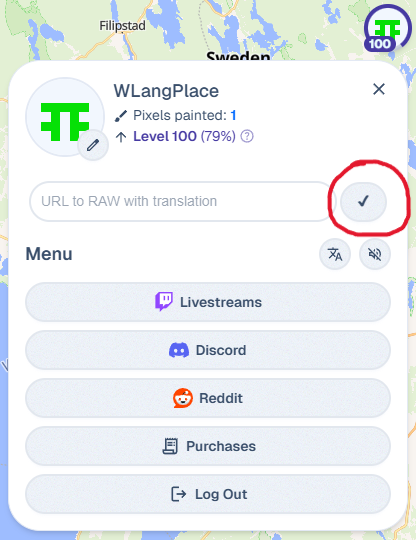

# WLangPlace

  

## About
This script is designed to apply custom translations for [wplace.live](https://wplace.live).  
On this page you can get instructions on how to install and use the WLangPlace script.

**Developed by:** G02m0n1k  
**Tested by:** KUsHa

Support chat:  

## Installation

Install using Tampermonkey and [direct link](https://raw.githubusercontent.com/G02m0n1k/WLangPlace/refs/heads/main/dist/WLangPlace.user.js)

I don't know how to use Tampermonkey

 <b>1. Go to your browser extension store and download Tampermonkey</b> 
<a href="https://addons.mozilla.org/en-US/firefox/addon/tampermonkey">> Firefox</a> 
<a href="https://chromewebstore.google.com/detail/tampermonkey/dhdgffkkebhmkfjojejmpbldmpobfkfo">> Chromium (Chrome, Edge and etc.)</a> 
  

If you are using Chromium, you will need to enable "Developer Mode" in the "Extensions" menu, and also give "Allow User Scripts" permission to Tampermonkey.

 
 <b>2. Install WLangPlace from this <a href="https://raw.githubusercontent.com/G02m0n1k/WLangPlace/refs/heads/main/dist/WLangPlace.user.js">direct link</a></b> 
 
 <b>3. Refresh <a href="https://wplace.live">wplace.live</a></b> 
 <b>4. Profit! :D</b>  

## How to use

After installing the script, a field will appear in your **profile**, as in the photo below  

   
In this field you will need to enter the path to **your** RAW file with the custom translation.  

After that, you will need to click on the check mark to the right of the field. If everything went smoothly, the translation will be applied.  

   

At the time of writing the instructions, a translation into [Russian](https://raw.githubusercontent.com/G02m0n1k/WLangPlace/refs/heads/main/langs-lib/russian.txt) is available, but you can also use your own translations :3  

If you want to remove the translation, leave the link field empty and click the check mark.  
The page will restart and the translation will disappear.

## Custom translation by yourself

Translating is quite simple!  

You need to select one of the files in [this folder](https://github.com/G02m0n1k/WLangPlace/tree/main/langs-lib).  

Then, use it as a template, where the <u>left part is the original phrase</u>, and the <u>right part is the text you translated</u>.  

**Please note that the files in the folder can be updated, since not all phrases may have been selected initially!**

## Do you want your translation to be added to the repository?

Write to the support chat:  

Or by email: <g02m0n1k@gmail.com>

## Thank you for using ♡